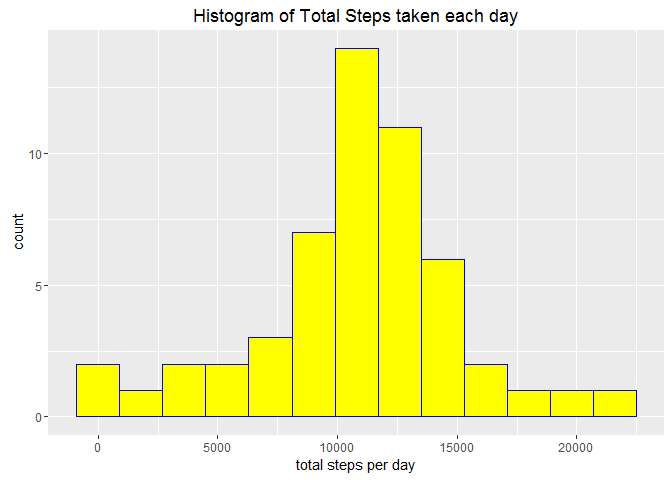
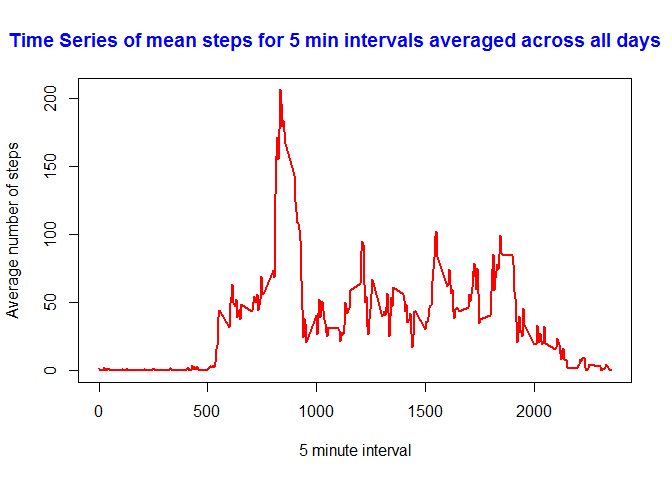
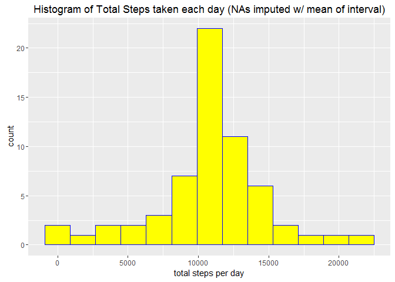

# Reproducible Research: Peer Assessment 1


Created by: Ravi Ancil Persad  
Created on: 08/11/2016  


## Loading and preprocessing the data
Please note that if you do not have the "plyr", "ggplot" and "lattice" libraries, install them using "install.packages(LibraryName)"


```r
library(plyr)
library(ggplot2)
library(lattice)
echo=TRUE

# 1. Load the data
unzip("activity.zip")
Activ_data <-  read.csv("activity.csv",header = T)

# 2. Process the data for analysis
# an intial observation of the data
summary(Activ_data) # we get some details about the data
```

```
##      steps                date          interval     
##  Min.   :  0.00   2012-10-01:  288   Min.   :   0.0  
##  1st Qu.:  0.00   2012-10-02:  288   1st Qu.: 588.8  
##  Median :  0.00   2012-10-03:  288   Median :1177.5  
##  Mean   : 37.38   2012-10-04:  288   Mean   :1177.5  
##  3rd Qu.: 12.00   2012-10-05:  288   3rd Qu.:1766.2  
##  Max.   :806.00   2012-10-06:  288   Max.   :2355.0  
##  NA's   :2304     (Other)   :15840
```

```r
summary(Activ_data$date) # we see there are 288 observations per day
```

```
## 2012-10-01 2012-10-02 2012-10-03 2012-10-04 2012-10-05 2012-10-06 
##        288        288        288        288        288        288 
## 2012-10-07 2012-10-08 2012-10-09 2012-10-10 2012-10-11 2012-10-12 
##        288        288        288        288        288        288 
## 2012-10-13 2012-10-14 2012-10-15 2012-10-16 2012-10-17 2012-10-18 
##        288        288        288        288        288        288 
## 2012-10-19 2012-10-20 2012-10-21 2012-10-22 2012-10-23 2012-10-24 
##        288        288        288        288        288        288 
## 2012-10-25 2012-10-26 2012-10-27 2012-10-28 2012-10-29 2012-10-30 
##        288        288        288        288        288        288 
## 2012-10-31 2012-11-01 2012-11-02 2012-11-03 2012-11-04 2012-11-05 
##        288        288        288        288        288        288 
## 2012-11-06 2012-11-07 2012-11-08 2012-11-09 2012-11-10 2012-11-11 
##        288        288        288        288        288        288 
## 2012-11-12 2012-11-13 2012-11-14 2012-11-15 2012-11-16 2012-11-17 
##        288        288        288        288        288        288 
## 2012-11-18 2012-11-19 2012-11-20 2012-11-21 2012-11-22 2012-11-23 
##        288        288        288        288        288        288 
## 2012-11-24 2012-11-25 2012-11-26 2012-11-27 2012-11-28 2012-11-29 
##        288        288        288        288        288        288 
## 2012-11-30 
##        288
```

```r
length(summary(Activ_data$date)) # shows that data comprises of observations for 61 days
```

```
## [1] 61
```

## What is the mean total number of steps taken per day?
__Answer__: Both the mean and median are 'central tendency' measures. From the computations below, the mean of the total number 
of steps taken per day is 10766.19, whilst, the median of the total number of steps taken per day is 10765.

### 1. Calculate the total number of steps taken per day

```r
Total_steps_per_day_with_NA <-  aggregate(Activ_data$steps,FUN=sum,by = list(Activ_data$date))

# As given in the instructions, let us ignore the missing values in the dataset (na.omit ignores 'NA' rows)
Total_steps_per_day  <-  na.omit(Total_steps_per_day_with_NA)

# renaming the columns of 'Total_steps_per_day' accordingly
names(Total_steps_per_day)[names(Total_steps_per_day)=="Group.1"] = "dates"
names(Total_steps_per_day)[names(Total_steps_per_day)=="x"] = "total_steps"
```

### 2. Make a histogram of the total number of steps taken each day

```r
qplot(Total_steps_per_day$total_steps,geom="histogram",binwidth=1800,fill=I("yellow"),col=I("blue"),
      xlab = "total steps per day", main="Histogram of Total Steps taken each day")
```

<!-- -->

### 3. Calculate and report the mean and median of the total number of steps taken per day

```r
# Mean_Total_steps_per_day
mean(Total_steps_per_day$total_steps)
```

```
## [1] 10766.19
```

```r
# Median_Total_steps_per_day
median(Total_steps_per_day$total_steps)
```

```
## [1] 10765
```

## What is the average daily activity pattern?
__Answer__: To analyze the average daily activity pattern, we esimated the mean number of steps taken at the 5 minute intervals, averaged across all days. Then, plotted the time-series as shown below. On observing the plot, it is obvious that on average, there is more activity (in particular one significant higher peaked observation at the 835 interval) during the earlier periods of the day when compared to lower activity periods as the days wears on. Towards the right-hand most side of the time series plot, it is noticeable that activity gradually decreases (as expected) as we move deeper into the night-time hours.

### 1. Make a time series plot of the 5-minute interval and average number of steps taken, averaged across all days.

```r
# compute mean number of steps per 5 minute interval averaged across all days
Mean_steps_by_interval  <-  aggregate(Activ_data$steps,FUN=mean,
                                           by = list(Activ_data$interval),na.rm=T)

# renaming the columns of 'Mean_steps_by_interval' accordingly
names(Mean_steps_by_interval)[names(Mean_steps_by_interval)=="Group.1"] = "interval"
names(Mean_steps_by_interval)[names(Mean_steps_by_interval)=="x"] = "mean_steps"

# let us do the time-series plot:
plot(Mean_steps_by_interval$interval,Mean_steps_by_interval$mean_steps, type="l",col="red",lwd=2,xlab="5 minute interval",ylab = "Average number of steps")
title("                 Time Series of mean steps for 5 min intervals averaged across all days                         ", col.main="blue") 
```

<!-- -->

### 2.Which 5-minute interval, on average across all days, contains the max. number of steps ?
__Answer__: Based on calculations below, the interval on average across all days which contains the max number
of steps is at the 835 interval which has an average of approximately 206.16 steps.


```r
index_location_of_max_val = which.max(Mean_steps_by_interval$mean_steps)
max_number_steps = Mean_steps_by_interval[index_location_of_max_val,]

print(max_number_steps)
```

```
##     interval mean_steps
## 104      835   206.1698
```

## Imputing missing values

### 1. Calculate and report the total number of missing values in the dataset  (i.e. total rows with NAs)  
__Answer__: Based on the code below, there are 2304 NA values in the dataset.


```r
Total_num_missing_vals = sum(is.na(Activ_data$steps))
print(Total_num_missing_vals)
```

```
## [1] 2304
```

### 2. Devise strategy for filling in all missing values in the dataset.    
__Answer__: My strategy will be to replace all the NA's with the MEAN for that 5-minute interval (as suggested in assignment).

### 3. Create a new dataset that is equal to the original dataset but with the missing data filled in.
__Answer__: The name of the new dataset with missing data filled in is a dataframe named "imp_df". We create it using the MEAN-based imputation strategy below:


```r
# let "imp_df" be our "new" Activity dataframe which we want to impute
imp_df <-  Activ_data

# -----looping through all rows in the dataframe -----#
for (i in 1:nrow(imp_df)) {
        # ----if the "step" for this current row is an NA, then proceed to imputation-----#
        if (is.na(imp_df$steps[i])) {
                # ---get "interval" id which contains this NA-----#
                interval_id_with_NA   <-  imp_df$interval[i]
                #---- get the corresponding mean steps value for this 5 minute interval-----#
                replacement  <-  Mean_steps_by_interval[Mean_steps_by_interval$interval == interval_id_with_NA,]
                # -----replace NA value with the corresponding mean steps value for this interval ----#
                imp_df[i,1] <- ifelse(is.na(imp_df$steps[i]),replacement$mean_steps,imp_df$steps[i])
        }
}

#------------- let's verify if NA's has been imputed----------------:
#  the following shows that no NA's are present anymore in the steps column
summary(imp_df) 
```

```
##      steps                date          interval     
##  Min.   :  0.00   2012-10-01:  288   Min.   :   0.0  
##  1st Qu.:  0.00   2012-10-02:  288   1st Qu.: 588.8  
##  Median :  0.00   2012-10-03:  288   Median :1177.5  
##  Mean   : 37.38   2012-10-04:  288   Mean   :1177.5  
##  3rd Qu.: 27.00   2012-10-05:  288   3rd Qu.:1766.2  
##  Max.   :806.00   2012-10-06:  288   Max.   :2355.0  
##                   (Other)   :15840
```

```r
# As an example, we display the first 6 rows here, which shows that we replaced the 
# NA's accordingly with the mean interval value:
head(imp_df) 
```

```
##       steps       date interval
## 1 1.7169811 2012-10-01        0
## 2 0.3396226 2012-10-01        5
## 3 0.1320755 2012-10-01       10
## 4 0.1509434 2012-10-01       15
## 5 0.0754717 2012-10-01       20
## 6 2.0943396 2012-10-01       25
```

### 4a. Make a histogram of the total number of steps taken each day (with imputed data)


```r
# Compute the total number of steps taken per day
Total_steps_per_day_imp  <-  aggregate(imp_df$steps,FUN=sum,by = list(imp_df$date))
names(Total_steps_per_day_imp)[names(Total_steps_per_day_imp)=="Group.1"] = "dates"
names(Total_steps_per_day_imp)[names(Total_steps_per_day_imp)=="x"] = "total_steps"

# plot histogram
qplot(Total_steps_per_day_imp$total_steps,geom="histogram",binwidth=1800,fill=I("yellow"),col=I("blue"),
      xlab = "total steps per day", main="Histogram of Total Steps taken each day (NAs imputed w/ mean of interval)")
```

<!-- -->

### 4b. Calculate and report the mean and median total number of steps taken per day.  
Answer: The mean and median values of total steps taken per day with imputation are both: 10766.19

```r
mean(Total_steps_per_day_imp$total_steps)
```

```
## [1] 10766.19
```

```r
median(Total_steps_per_day_imp$total_steps)
```

```
## [1] 10766.19
```

### 4c. Do these values differ from the estimates from the first part of the assignment?What is the impact of imputing missing data on the estimates of the total daily number of steps?  
__Answer__:
Based on the computations below, the mean value of total steps taken per day (with imputation of the NA's) has remain unchanged when compared to 
the mean from the first part of the assignment. However, the median of the total steps taken per day (with imputation
of the NA's) has slightly increased (by 1.18 steps) when compared to the first median value from the first part of the assignment.
On comparing the first histogram (located above) with the second histogram derived after imputation (located below), we can see that upon visual inspection 
that the second histogram seems to have a sharper peak and higher distribution around the mean value. This can possibly be attributed to the MEAN-based imputation that was applied to the dataset.


```r
# Difference_betwen_1st_and_2nd_Mean (with imputations vs. no imputation)
mean(Total_steps_per_day_imp$total_steps) - mean(Total_steps_per_day$total_steps)
```

```
## [1] 0
```

```r
#Difference_betwen_1st_and_2nd_Median (with imputations vs. no imputation)
median(Total_steps_per_day_imp$total_steps) - median(Total_steps_per_day$total_steps)
```

```
## [1] 1.188679
```


## Are there differences in activity patterns between weekdays and weekends?

__Answer__: From observing the panel plots created below, the answer is yes, there are differences in activity patterns between weekdays and weekends. Visually, the weekend plot has higher periods of consistent activity throughtout the day. In comparison, the weekday plot has a noticeable activity spike in the earlier periods of the day and tends to decrease as we move later into the day. 

### 1. Create a new factor variable with two levels- "weekday" and "weekend" for the given dates.

```r
# use given dates in the dataset to identify days of the week using the "weekdays()" function
imp_df$date  <-  as.POSIXlt(imp_df$date) # date converted to be in the "POSIXlt" calendar format
imp_df$Name_of_Day  <- weekdays(imp_df$date) # get Names of days based on dates

# classifying as weekend or weekday
imp_df["Type_of_day"]  <-  as.factor(ifelse(imp_df$Name_of_Day=="Saturday"| imp_df$Name_of_Day=="Sunday", "weekend", "weekday"))

# By running the "summary()" function on the line below, we see that there are 12960 weekdays compared to 
# the lesser number of weekends (4608).
summary(imp_df$Type_of_day)
```

```
## weekday weekend 
##   12960    4608
```

### 2. Make a panel plot time series of 5 minute intervals for the average number of steps taken for weekdays and weekends.

```r
# compute mean number of steps per 5 minute interval averaged across weekdays/weekends 
Daytype_Mean_steps_by_interval  <-  aggregate(imp_df$steps,FUN=mean,
                                   by = list(imp_df$Type_of_day,imp_df$interval),na.rm=T)

# renaming columns accordingly
names(Daytype_Mean_steps_by_interval)[names(Daytype_Mean_steps_by_interval)=="Group.1"] = "Type_of_day"
names(Daytype_Mean_steps_by_interval)[names(Daytype_Mean_steps_by_interval)=="Group.2"] = "interval"
names(Daytype_Mean_steps_by_interval)[names(Daytype_Mean_steps_by_interval)=="x"] = "mean_steps"

xyplot(mean_steps ~ interval | Type_of_day, data = Daytype_Mean_steps_by_interval, layout=c(1,2), type = 'l',
       xlab="Interval", ylab="Number of steps")
```

<!-- -->


